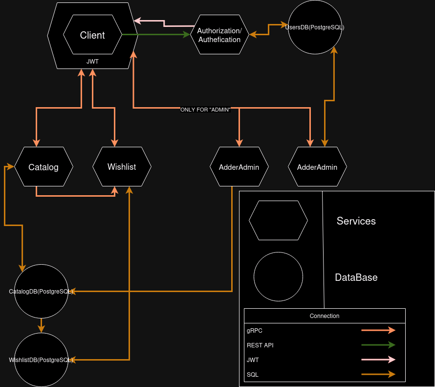

# Internet Shop v1
### Its my first try creating big project with MicroServices Architecture
#### Project using gRPC and REST API methods,for authorization and authefication using JWT
#### SQL - PostgreSQL

##### Typo: Left AdderAdmin:=AdderToCatalog
#### PS I hope that readers will understand at least the scheme:)
#### And also, after i am started learning Golang passed 1 month and 6 days
